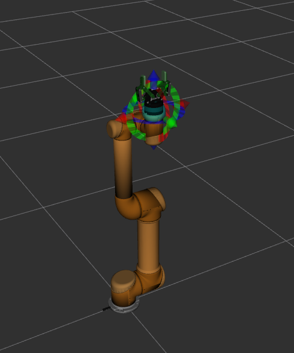
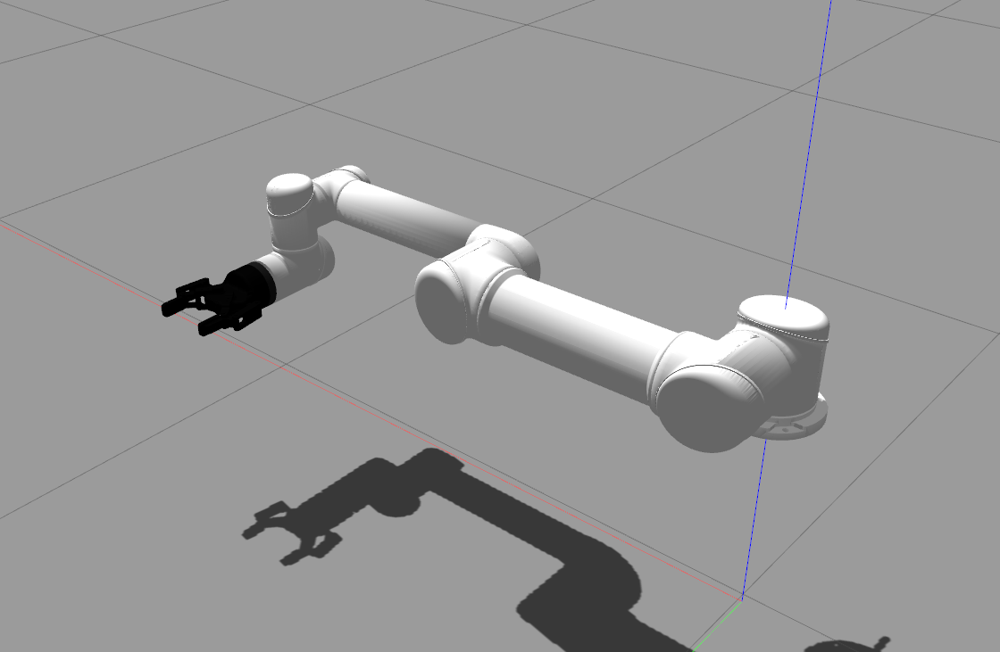
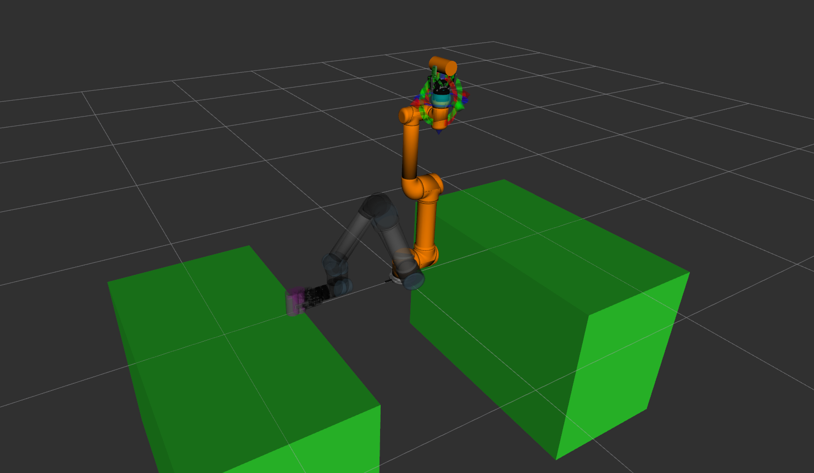
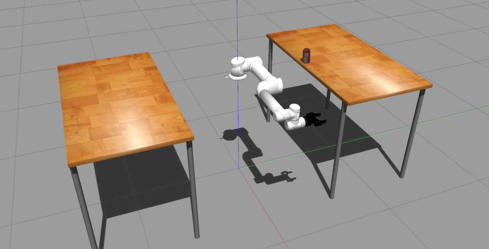

# UR5 with Robotiq-2f-85 in MoveIt and Gazebo

This project enables UR5 robot wiht Robotiq-2f-85 to work in MoveIt and Gazebo [still in works]. Basic Pick-and-Place task is included.

The project is based on the following packages:
- https://github.com/philwall3/UR5-with-Robotiq-Gripper-and-Kinect
- https://github.com/utecrobotics/ur5
- https://github.com/utecrobotics/robotiq
- https://github.com/roboticsgroup/roboticsgroup_upatras_gazebo_plugins


## Installation process
```sh
$ git clone https://github.com/vsimundic/ur5-robotiq_85-gazebo.git
$ cd ur5-robotiq_85-gazebo
$ catkin_make
$ source devel/setup.bash
```
## MoveIt visualization
To visualize robot in Rviz with MoveIt, launch the following:
```sh
$ roslaunch ur5_robotiq_85_moveit_config demo.launch
```


## Gazebo visualization
```sh
$ roslaunch ur5_robotiq_85_moveit_config demo_gazebo.launch
```


## Pick-and-Place MoveIt
First, run this:
```sh
$ roslaunch ur5_robotiq_85_manipulation pickandplace_moveit.launch
```
After everything goes up, in another terminal run:
```sh
$ roslaunch ur5_robotiq_85_manipulation pickandplace.launch
```


## Pick-and-Place MoveIt with Gazebo [still in works]
First, run this:
```sh
$ roslaunch ur5_robotiq_85_manipulation pickandplace_gazebo.launch
```
After everything goes up, in another terminal run:
```sh
$ roslaunch ur5_robotiq_85_manipulation pickandplace.launch
```

